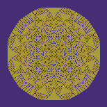
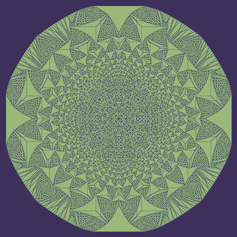
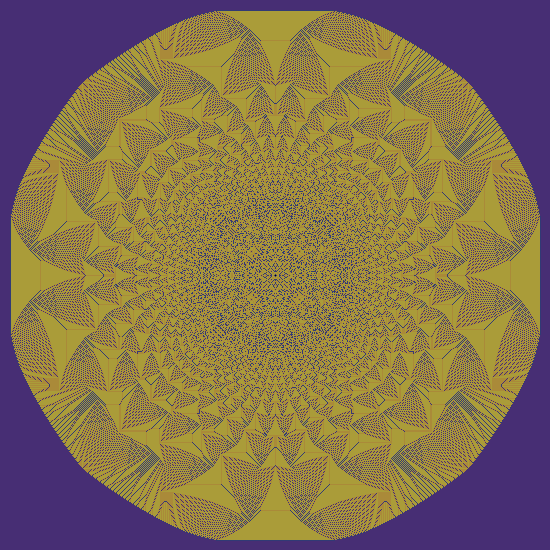
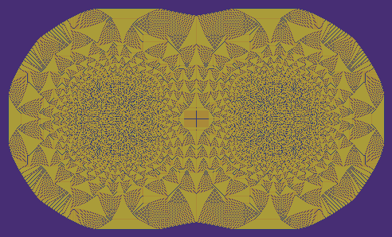
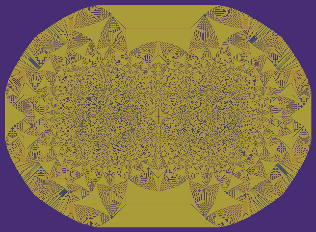

# sandpiles

Inspired by
[Fractal Zero](https://www.youtube.com/watch?v=1MtEUErz7Gg)

Now using a bounding box to speed up the topples. Looping through the entire image space is very slow.

Still using a double loop. First loop copies values from one grid to the temp grid. Second loop does the actual topple.

Starting the run with the number of grains in the starting spot is faster than adding one grain at a time, then running topple. 

## Timing and tuning tests. No optimazations.

- Triple loop
  - 6000 grains
    - Time 1m22.959370164s
- Double loop 
  - 6000 grains 
    - Time 56.509960683s
  - 600000 
    -Time 2h21m6.07087493s
- Single loop 
  - failed 
  - took 15 seconds but it had the wrong results

## Rectangle bounding

- Double loop
  - 6000 grains
    - Time 16.838954968s **WOW**
  - 60000 grains
    - Time 3m36.471748631s
  - 600000 grains
    - Time 52m54.697291662s
  - 1000000 grains
    - Time 1h40m8.293423533s

## Changing ints to fixed size.

## Base line before changes. Loading cell with total grains.
- 4,095 1<<12 - 1
  - Time 10.626969828s
  - Frames: 2926
  - w:68 h:68
- 8,191 1<<13 - 1
  - Time Time 25.623525736s
  - Frames: 6384
  - w:86 h:86
- 16,383 1<<14 - 1
  - Time 52.905092416s
  - Frames: 14428
  - w:114 h:114
- 32,767 1<<15 - 1
  - Time 1m50.013343568s
  - Frames: 29026
  - w:154 h:154

## Putting 1 grain at a time in a loop

- 4,095
  - Time 50.558171937s
  - Frames: 9743
  - w:68 h:68
- 8,191
  - Time 2m9.911933306s
  - Frames: 26581
  - w:86 h:86

** looping is to slow **

## Changing grid depth to uint8 and 128 grains per loop

- 2,048 1<<11
  - Time 1.042953439s
  - Frames: 1786
  - w:54 h:54
- 4,096 1<<12
  - Time 2.688006804s
  - Frames: 4757
  - w:68 h:68
- 8,192 1<<13
  - Time 8.030793469s
  - Frames: 13502
  - w:86 h:86
- 16,384 1<<14
  - Time 24.584770951s
  - Frames: 40685
  - w:114 h:114
- 32,768 1<<15
  - Time 1m13.624960493s
  - Frames: 118091
  - w:154 h:154
  

- 65,536 1<<16
  - Time 3m37.552113689s
  - Frames: 339165
  - w:208 h:208
- 131,072 1<<17
  - Time 11m27.005981101s
  - Frames: 978338
  - w:286 h:286
  
- 262,144 1<<18
  - Time 40m7.255383462s
  - Frames: 2816895
  - w:394 h:394
 

- 524,288 1<<19
  - Time 2h20m7.341924448s
  - Frames: 7823272
  - w:550 h:550

## Split piles

- center-100 & center+100
  - 131,072 1<<17
    - Time 20m57.960329207s
    - Frames: 1450693
    - w:492 h:298

  - 262,144 1<<18
    - Time 1h44m23.312677082s
    - Frames: 5562422
    - w:620 h:454
    

## 2^x

|bits|Count|
|:-:|-:|
|8|	256|
|9|	512|
|10|	1,024|
|11|	2,048|
|12|	4,096|
|13|	8,192|
|14|	16,384|
|15|	32,768|
|16|	65,536|
|17|	131,072|
|18|	262,144|
|19|	524,288|
|20|	1,048,576|
|21|	2,097,152|
|22|	4,194,304|
|23|	8,388,608|
|24|	16,777,216|
|25|	33,554,432|
|26|	67,108,864|
|27|	134,217,728|
|28|	268,435,456|
|29|	536,870,912|
|30|	1,073,741,824|
|31|	2,147,483,648|
|32|	4,294,967,296|
